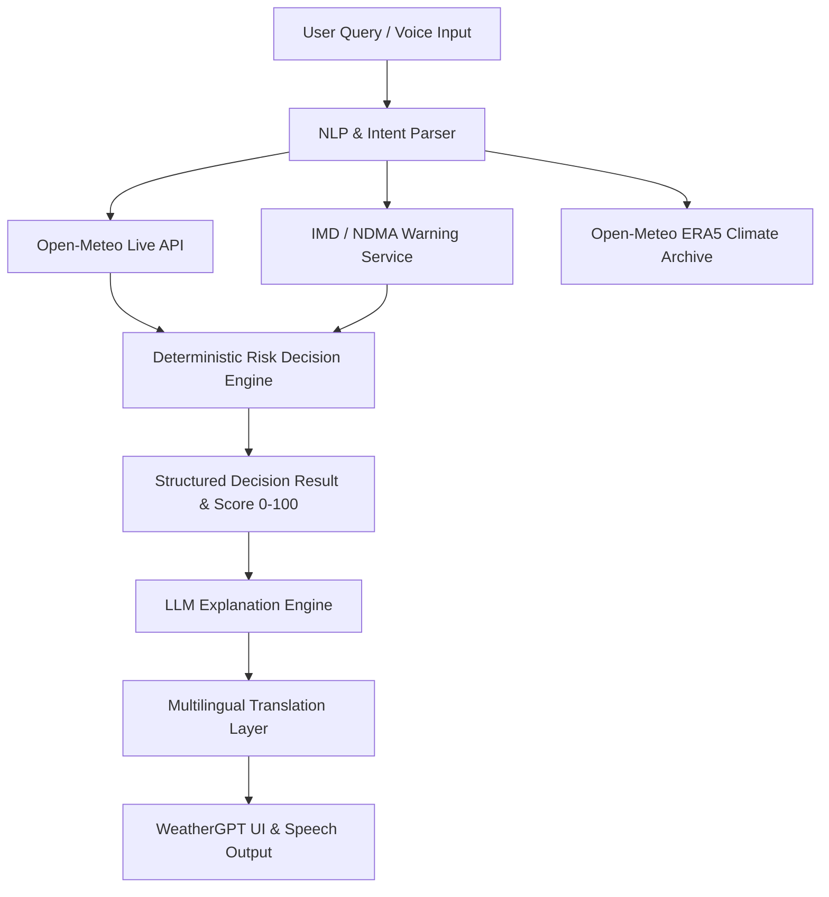

# WeatherGPT — From Weather Data to Better Decisions

> **Smart India Hackathon (SIH) 2026 Project Submission**
> An evidence-grounded, weather-aware conversational decision assistant that combines real-time weather telemetry, forecasts, severe weather warnings, and historical climate intelligence to help users make personalized, actionable weather-related decisions.

---

## 📌 Problem Statement
Weather telemetry (temperature, precipitation, wind vectors, warnings) is distributed across complex meteorological portals and index tables that can be difficult for ordinary citizens, farmers, event organizers, and daily commuters to interpret. Generic weather apps provide raw numbers without explaining **what action a user should take**.

## 💡 Solution: WeatherGPT
WeatherGPT bridges raw meteorological observation and personalized human action. It integrates live Open-Meteo forecasts and official IMD/NDMA warning feeds into a deterministic decision engine, augmented by a grounded AI conversational assistant capable of natural-language understanding in **English, Telugu, Tamil, Hindi, Kannada, and Malayalam** with voice input/output.

---

## 🛠️ System Architecture & Data Flow

### Source-of-Truth Rule
- **Weather Facts & Forecasts**: Grounded directly from Open-Meteo API telemetry.
- **Severe Weather Warnings**: Sourced from official IMD / NDMA CAP bulletins.
- **Historical Climate**: Sourced from ERA5 reanalysis archive records.
- **Risk Score**: Calculated strictly by a deterministic mathematical risk matrix.
- **AI Role**: Responsible strictly for natural-language understanding, context retention, translation, and user-friendly explanation. Never fabricates weather metrics.

---

## ✨ Key Features & Capabilities

1. **Weather-Aware Conversational AI**: Natural language chat answering questions like *"Will it rain today?"*, *"Can I play cricket tomorrow evening?"*, or *"Was this month hotter than usual?"*.
2. **Deterministic Activity Risk Analyzer**: Calculates localized risk scores (0–100) and safety recommendations for travel, farming, sports, freight, and outdoor events.
3. **Warning-First Architecture**: Prominently highlights official severe weather warnings with valid time windows and safety actions.
4. **"🔍 Why This Answer?" Explainability**: Full breakdown of weather factors, rain probabilities, wind speeds, warning overrides, and data source attribution.
5. **Climate Intelligence Dashboard**: Historical baseline comparisons across 2023–2026, temperature anomalies, and precipitation accumulation charts.
6. **Multilingual & Voice Support**: Supports English, Telugu, Tamil, Hindi, Kannada, Malayalam, and Romanized script queries with Speech-to-Text and Text-to-Speech playback.

---

## 🚀 Technology Stack

- **Frontend**: React 18, TypeScript 5.7, Vite 6.0, Vanilla CSS Modules
- **Icons & Visuals**: Lucide React, Custom SVG Charts
- **Routing**: React Router DOM v6
- **Data Providers**:
  - Live Forecast: Open-Meteo Global Forecast API
  - Severe Warnings: IMD / NDMA Alert Provider Integration
  - Climate Archive: Open-Meteo ERA5 Reanalysis API
- **Voice APIs**: Web Speech API (`SpeechRecognition` & `SpeechSynthesis`)

---

## 📋 SIH Demonstration Flow

1. **Location & Weather Overview**: Open WeatherGPT Home, detect browser location or search any city (e.g. *Chennai*, *Bengaluru*, *Mumbai*).
2. **Warning-First Check**: View official district weather advisories and warning severity status.
3. **Natural-Language Decision Query**: Ask *"Can I play cricket tomorrow evening?"*. Review the calculated risk score (e.g. `68/100 MODERATE-HIGH`) and recommendation.
4. **Context Shift & Time Comparison**: Ask follow-up *"What about morning?"*. Observe automatic context retention and time window comparison.
5. **Multilingual & Voice**: Switch language to Telugu (*"రేపు సాయంత్రం క్రికెట్ ఆడవచ్చా?"*) or click the Microphone icon to speak. Listen to Text-to-Speech response.
6. **Climate Intelligence**: Open Climate tab and query *"Was this month hotter than usual?"* to inspect historical baseline comparisons.

---

## ⚠️ Limitations & Scope
- **Forecast Horizon**: Reliable hourly and daily forecast telemetry extends up to 7–14 days.
- **Voice Support**: Requires browser support for Web Speech API (supported in Chrome/Edge/Safari). Falls back gracefully to text input.
- **Decision Support Disclaimer**: WeatherGPT provides forecast-based decision support and does not replace official emergency disaster authorities.
